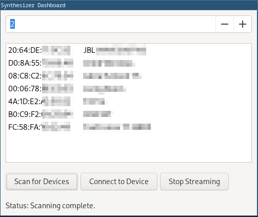

# Bluetooth Manager Package - Examples

This directory contains a few examples.
Take a look if you are instressted.

## CLI

A simple command line interface to use some of the Bluetooth manager package features.

```txt
$ ./examples/cli.py --help
usage: cli.py [-h] [--manage] [--scan] [--connect MAC] [--disconnect] [--list] [--channel CHANNEL] [--config CONFIG] [--verbose]

CLI tool for managing Bluetooth devices.

options:
  -h, --help         show this help message and exit
  --manage           Manage connections automatically.
  --scan             Scan for available Bluetooth devices.
  --connect MAC      Connect to a specific Bluetooth device by MAC address.
  --disconnect       Disconnect all devices.
  --list             List all connected devices.
  --channel CHANNEL  Specify the channel otherwise the default channel is used.
  --config CONFIG    Configuration to load.
  --verbose          Enable verbose output.
```

## Synthesizer Dashboard

A GUI application which demonstrate how to discover, connect and play a simple tone to an Bluetooth audio device.

This application has additional dependencies to the Bluetooth manager package.
It requirements Numpy, PyAudio and the wxPython libraries.

Install Numpy and PyAudio via pip:

```bash
pip install numpy pyaudio
```

Install wxPython via one of the following commands:

```bash
# Ubuntu
sudo apt-get install python-wxtools
# ArchLinux
sudo pacman -S python-wxpython
# Python only
pip install wxPython
```

After all requirements are meet just start the application:

```bash
./examples/SynthDash.py
```


